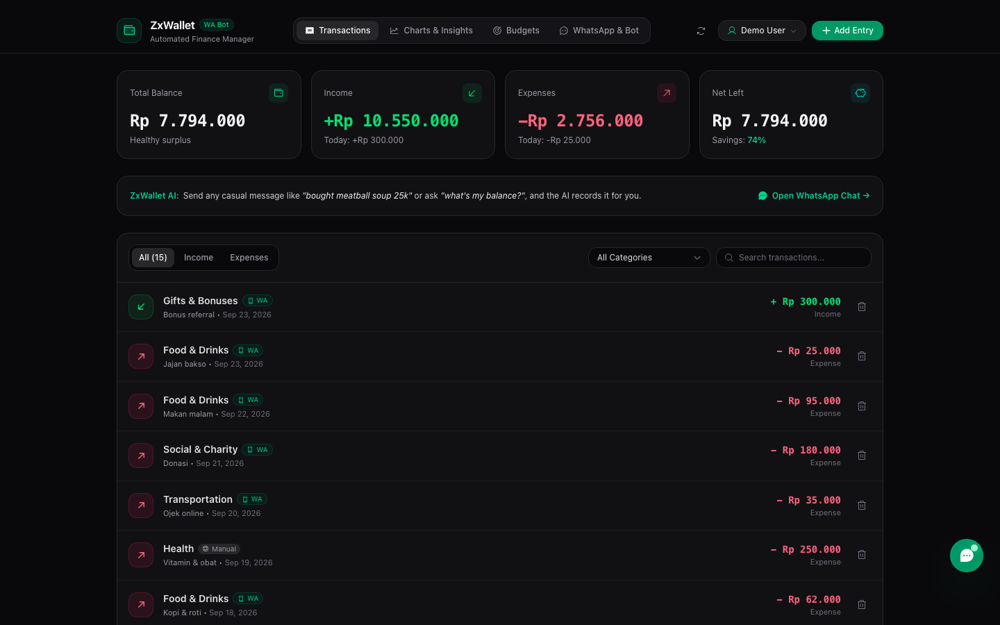
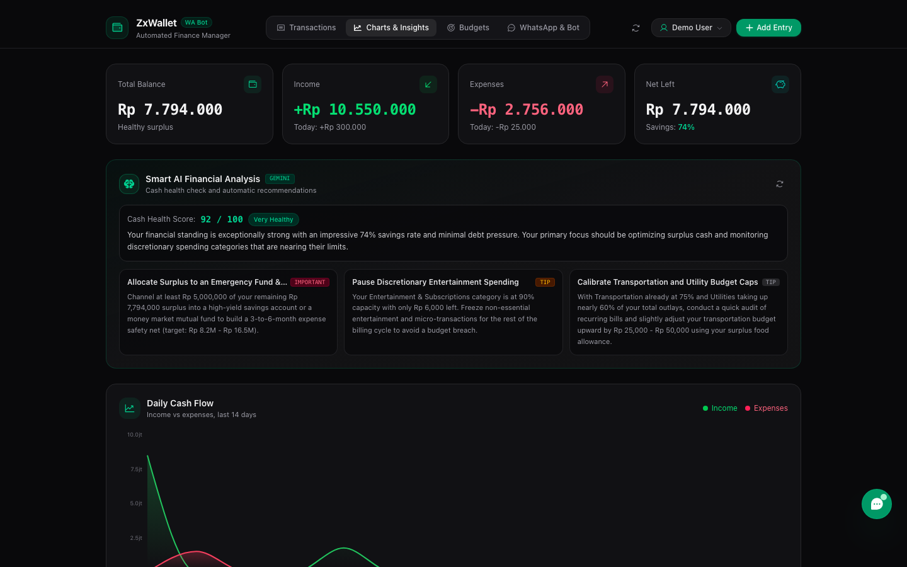
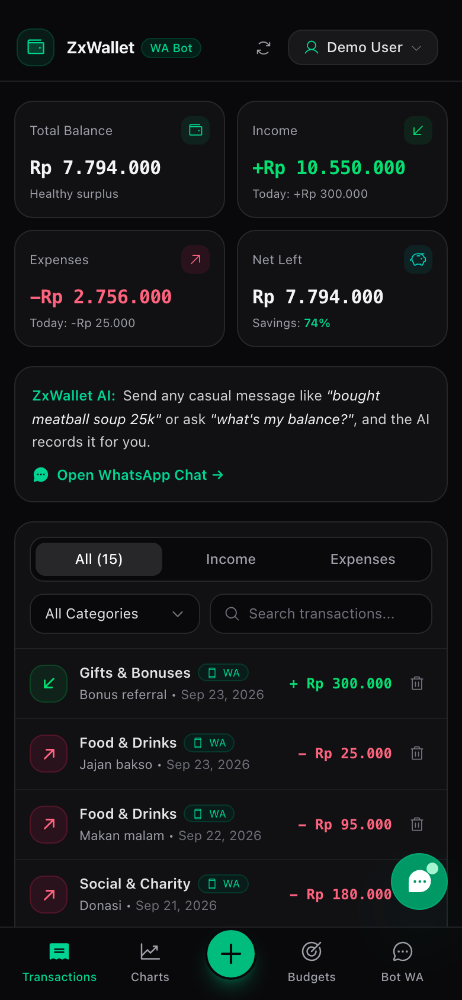
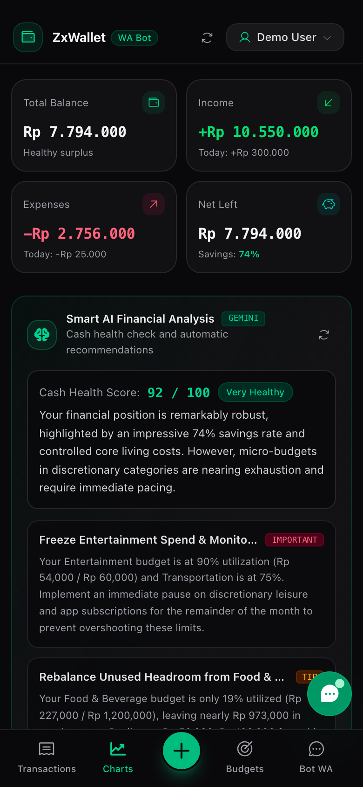
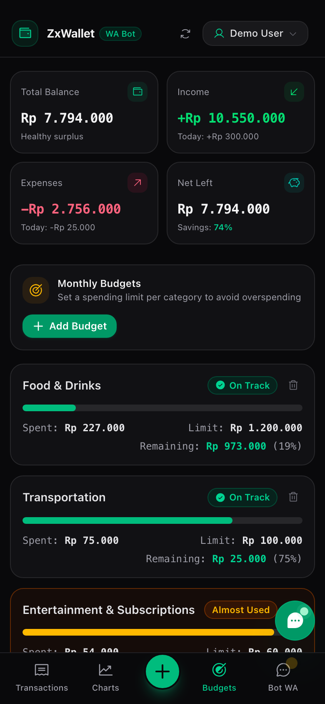

# ZxWallet

**English** | [Bahasa Indonesia](README.id.md)

An AI-powered WhatsApp bot for personal finance. Log income and expenses in casual chat, check your balance and budgets, and get Excel/PDF reports delivered right in WhatsApp. It comes with a web dashboard (installable as a PWA) that shows charts and AI insights.

## Screenshots

> Screenshots use demo data.

### Desktop





### Mobile

<p>
  
  
  
</p>

## Features

- **Chat-based logging.** Send messages like `beli kopi susu 18k` or `masuk gaji 7jt`. The AI extracts the amount, type, and category, and records the transaction.
- **Balance and summaries.** Ask for your balance, today's transactions, or a monthly recap in plain language.
- **Excel/PDF export.** Ask for a file, for example `kirim excel semua transaksi` or `rekap bulan ini pdf`, and the bot sends it back as a WhatsApp document.
- **Budgets.** Set a monthly limit per category and track how much of it you have used.
- **Web dashboard.** View transactions, charts, budgets, and an AI health score. It also includes a chat simulator for testing the bot without WhatsApp.
- **Bilingual.** The dashboard switches between Indonesian and English, and the bot replies in the language you write in.
- **Accounts.** Registration uses an OTP sent through WhatsApp. You must log in to use the dashboard.

## Tech stack

Next.js 16 · React 19 · TypeScript · Tailwind CSS 4 · SQLite (better-sqlite3) · Baileys (WhatsApp Web) · Zustand · Recharts · ExcelJS · jsPDF

The AI calls go to any OpenAI-compatible `/chat/completions` endpoint, configured by `OMNI_BASE_URL`.

## Getting started

Requirements: Node.js 20 or later, and a WhatsApp account to link as the bot.

```sh
npm install
cp .env.example .env   # then fill in the values
npm run dev
```

Open http://localhost:3006, log in, go to the **Bot WA** tab, and scan the QR code with WhatsApp (**Linked devices**).

For production:

```sh
npm run build
npm start
```

## Configuration

| Variable | Description |
| --- | --- |
| `OMNI_BASE_URL` | Base URL of the OpenAI-compatible API, for example `https://your-host/v1` |
| `OMNI_API_KEY` | API key for that endpoint |
| `OMNI_MODEL` | Model name to use |
| `JWT_SECRET` | Secret for signing login tokens. Use a long random string, for example `openssl rand -hex 32`. |

### Bot owner number

The bot only replies to one WhatsApp number, and only that account can manage the WhatsApp connection. That number (`62895400233001`) is currently hardcoded. To use your own number, replace it in:

- `src/lib/baileysService.ts`
- `src/app/api/wa/status/route.ts`
- `src/app/api/wa/logout/route.ts`
- `src/app/api/wa/restart/route.ts`
- `src/components/WhatsAppSection.tsx`

## Project structure

```
src/app/            Next.js pages and API routes
src/components/     Dashboard UI
src/lib/            Database, auth, AI, WhatsApp (Baileys), report export
server/botRunner.js Starts the WhatsApp connection and logs its status
data/               SQLite database (created on first run, git-ignored)
auth_info_baileys/  WhatsApp session (git-ignored, keep it private)
```

## Security notes

- Never commit `.env`, `data/`, or `auth_info_baileys/`. The session folder gives full access to the linked WhatsApp account.
- Baileys is an unofficial WhatsApp Web client. Using it may violate WhatsApp's terms, so use it at your own risk.
